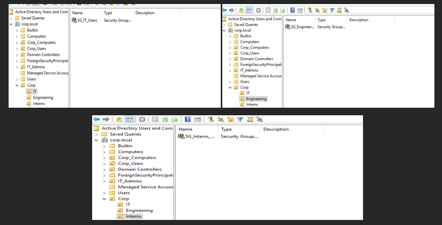
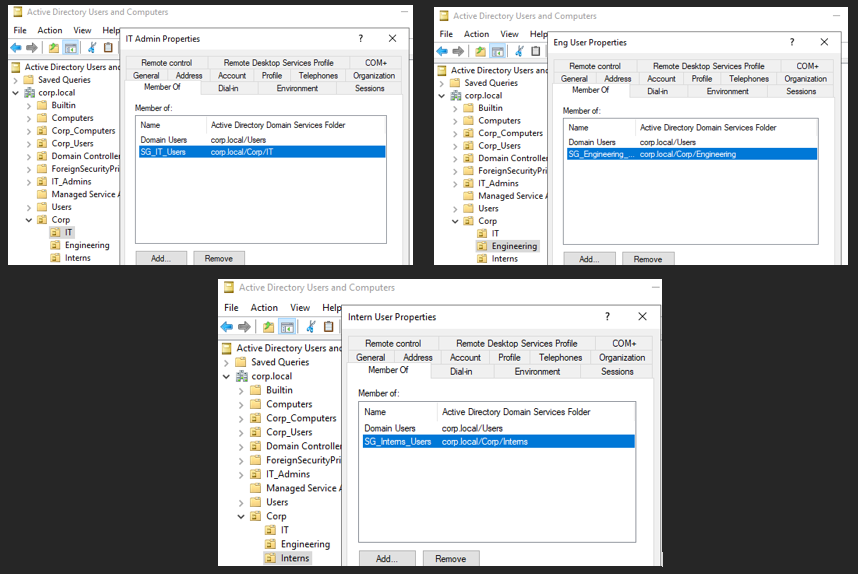
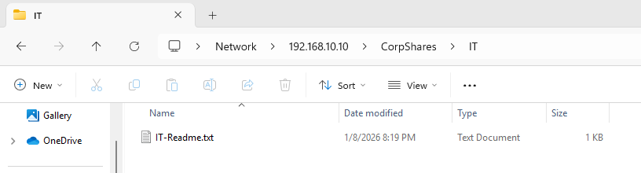

## Environment
- Windows Server 2019 (Domain Controller)
- Windows 11 (Domain-joined client)
- VirtualBox internal network

## Objective
Design a realistic Active Directory OU structure to support
user lifecycle management, access control, and Group Policy enforcement.

### Phase 1 – OU Design
Created a structured OU hierarchy to support role-based access,
Group Policy application, and clean user lifecycle management.
This mirrors real-world environments where new structure is
introduced without disrupting existing objects.

## Phase 2 – User Onboarding & Access Control

### Phase 2.1 – Security Groups
Created role-based security groups to support least privilege access and
simplify user onboarding. Permissions are assigned to groups rather than
individual users.

### Phase 2.2 – User Onboarding & Group Assignment
Simulated user onboarding by creating role-based user accounts and
assigning access through security group membership. This approach
supports least privilege access and simplifies role changes and
offboarding.

### Phase 3 – File Server & NTFS Permissions
Implemented a centralized file share on the domain controller. NTFS permissions
were applied to departmental folders using security groups to restrict access.
Access was validated using role-based user accounts.

### Phase 4 – Drive Mapping via Group Policy
Configured Group Policy Preferences to map departmental network drives at logon.
The IT department share is automatically mapped for authorized users, providing
a seamless and secure user experience via This PC.
